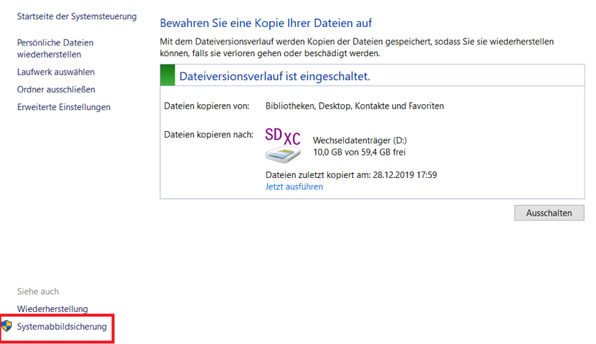

## Anleitung: Datenversionsverlauf aktivieren für die Datensicherung 

Der Dateiversionsverlauf in Windows ermöglicht es Ihnen, Ihre Dateien inkrementell zu sichern. Jedes Mal, wenn Windows das Backup durchführt, werden Kopien der veränderten oder neu erstellten Dateien angelegt. 

1. Sollten Sie auf derselben Festplatte Ihre Systemabbilder speichern wollen müssen Sie diese vorher formatieren. Einfacher ist es, zwei externe Festplatten zu nehmen. Eine für Ihre Daten und eine für Ihre Systemabbilder.
2. Stellen Sie sicher, dass Windows10 Ihre externe Festplatte erkennt und sie funktioniert.
3. Öffnen Sie die PC-Einstellung durch Drücken der Tastenkombination Windows + i
4. Wählen Sie die Schaltfläche „Update und Sicherheit“ aus.

5. Unter dem Menüpunkt „Sicherung“ finden Sie rechts ein Plus-Zeichen neben „Laufwerk hinzufügen“. Klicken Sie darauf.

6. Windows10 zeigt nun alle Festplatten an, die sich für den Dateiversionsverlauf anbieten. Wählen Sie eine aus.
7. Der Schalter bei „Meine Dateien automatisch sichern“ sollte auf Ein stehen.
8. Klicken Sie darunter auf den Schriftzug „Weitere Optionen“.
9. Scrollen Sie in den weiteren Optionen nach unten, um festzulegen, welche Ordner gesichert werden sollen. Unter „Diese Ordner sichern“ können Sie die Standard-Ordner von Windows anklicken und bei Bedarf entfernen. Außerdem können Sie auch eigene Ordner hinzufügen.

10. Ordner ausschließen können Sie weiter unten. Beachten Sie, dass dann auch alle Unterordner des Ordners ausgeschlossen sind.  
11. Um den Zustand Ihrer Dateien sofort zu sichern, klicken Sie auf den Button „Jetzt sichern“. 
12.	Bei „Sicherungsgröße“ sehen Sie, wie viel Speicherplatz die Dateiversionsverläufe belegen.
13.	Darunter können Sie in den Dropdown-Menüs einstellen, wie häufig und für und wie lange Windows die Dateiversionsverläufe anlegen soll.
14.	Standardmäßig speichert Windows10 diese jede Stunde und löscht auch keine alten Sicherungen. Das bedeutet, dass unter Umständen irgendwann die Festplatte voll wird. Sie können aber auch andere Werte eintragen, etwa, dass Windows die Sicherungen nur 3 Monate behält oder 1 Jahr lang oder bis Platz gebraucht wird.

## Systemabbild

### Systemabbild erstellen

Ein Systemabbild speichert nicht nur die Nutzdaten, sondern das gesamte Dateisystem, inklusive Betriebssystem, Programmdaten und Benutzereinstellungen. Damit kann das System auf dem gleichen Computer komplett wieder so hergestellt werden, wie es zu dem Zeitpunkt der Sicherung war. 
1. Stellen Sie sicher, dass Ihre Festplatte mit NTFS formatiert ist. NTFS ist das Dateisystem von Windows. Sie können sonst kein Systemabbild auf der externen Festplatte speichern.
2. Drücken Sie dafür die Tastenkombination Windows + E, um den Windows-Explorer zu öffnen.
3. Klicken Sie dann auf „Dieser PC“ und finden Sie Ihre externe Festplatte.
4. Klicken mit der rechten Maustaste auf die Festplatte, die Sie benutzen möchten.
5. Es öffnet sich ein Menü. Klicken Sie auf „Eigenschaften“ ganz unten.
6. Hier sehen Sie nun, wie Ihre Festplatte formatiert ist. Wenn hier etwas anderes als NTFS, wie zum Beispiel exFat steht, müssen Sie Ihre Festplatte zuerst formatieren. Wie das geht können Sie hier nachlesen: https://www.giga.de/downloads/microsoft-windows/tipps/festplatte-formatieren/  **Vorsicht**: Sichern Sie Ihre Daten von der Festplatte bevor Sie sie formatieren.
7. Wenn Ihre Festplatte NTFS formatiert ist, öffnen Sie die PC-Einstellung durch Drücken der Tastenkombination Windows + i
8. Wählen Sie die Schaltfläche „Update und Sicherheit“ aus.

9. Unter dem Menüpunkt „Sicherung“ finden Sie rechts einen Schriftzug „Weitere Optionen“. Klicken Sie darauf.
10.	Scrollen Sie ganz nach unten und klicken Sie auf den link „siehe erweiterte Einstellungen“

11.	Ganz unten links ist ein Schriftzug mit „Systemabbildsicherung“. Klicken Sie darauf.

12.	Dann klicken Sie links auf „Systemabbild erstellen“.
13.	Um Ihre Festplatte als Speichermedium auszuwählen. Klicken Sie auf den Kreis neben dem Schriftzug „Auf Festplatte“, wählen Sie Ihre Festplatte aus und klicken dann auf „Weiter“.

14.	Windows zeigt Ihnen jetzt welche Laufwerke alles gesichert werden. Die für den Betrieb von Windows benötigten Laufwerke werden automatisch in die Sicherung einbezogen.  Außer Sie wollen noch weitere Laufwerke sichern, lassen Sie alles wie es ist und klicken auf „Weiter“.
15.	Nun zeigt Windows Ihre Sicherungs-Einstellungen. Vergewissern, Sie dass alles richtig ist und klicken Sie auf „Sicherung starten“. Der Prozess kann ein paar Minuten dauern.

16.	Sie werden vielleicht noch gefragt, ob Sie noch zusätzlich einen Systemreparaturdatenträger erstellen möchten. Das können Sie ignorieren.
17.	Sie haben nun ein Systemabbild auf Ihrer externen Festplatte erstellt. Klicken Sie im File-Explorer auf dieser „Dieser PC“ und dann auf Ihre Festplatte. Sie sollten dort einen Ordner finden mit dem Namen „WindowsImageBackup“.
18.	Wichtig: Sollten Sie ein weiteres Systemabbild erstellen, wird dieser Ordner überschrieben, wenn sich das alte Systemabbild weiterhin im obersten Verzeichnis der Festplatte befindet. Deshalb sollten Sie sichergehen, wenn Sie das vorige Systemabbild behalten wollen, dass Sie vor dem Erstellen eines weiteren Systemabbildes das vorige Systemabbild in einen Unterordner verschieben. Am besten Sie geben diesem Unterordner einen passenden Namen wie beispielsweise „Systemabbild vor dem neuen Windows-Update“. 

### Systemabbild wiederherstellen

Wenn Windows nicht richtig funktioniert oder Sie aus anderen Gründen ein Image-Backup wiederherstellen wollen, müssen Sie die Erweiterten Start-Optionen aufrufen. Sollte Windows gar nicht mehr hochfahren können Sie diese auch aufrufen, indem Sie Windows von einem Reparaturdatenträger oder der Windows10-Installations-CD booten. Vorsicht: Alle Dateien, die Sie seit Erstellung des Speicherabbildes erstellt oder verändert wurden, sind danach verloren. Wenn Sie diese noch brauchen, speichern Sie sie vorher zusätzlich auf einer externen Festplatte ab.
1. Öffnen Sie das Startmenü und klicken auf den Pfeil neben Herunterfahren.
2. Halten Sie die Umschalttaste gedrückt und klicken dabei auf „Neu starten“.
3. Es erscheint ein blauer Bildschirm namens „Option auswählen“.
4. Klicken Sie auf „Problembehandlung“ und dann auf „Erweiterte Optionen“.
5. Sie befinden sich nun in den Erweiterten Start-Optionen. Wählen Sie „Systemimage-Wiederherstellung“ aus. Windows startet neu und zeigt erneut einen blauen Bildschirm. 

6. Wählen Sie das Konto aus, mit dem das Image erstellt wurde.
7. Geben Sie danach das Passwort für das Konto ein und klickt auf den Button „Fortsetzen“. 

8. Windows wählt standardmäßig Ihr letztes Systemabbild aus. Wählen Sie alternativ ein anderes Image unter „Systemabbild auswählen“. Ansonsten klicken Sie auf „Weiter“.
9. Das Fenster „Weitere Wiederherstellungsoptionen auswählen“ erscheint. Klicken Sie auf „Weiter“ und auf „Fertig stellen“.
10. Bestätigen Sie den Hinweis mit „Ja“. Der Vorgang kann je nach Größe des Windows-Laufwerks mehrere Minuten dauern.

